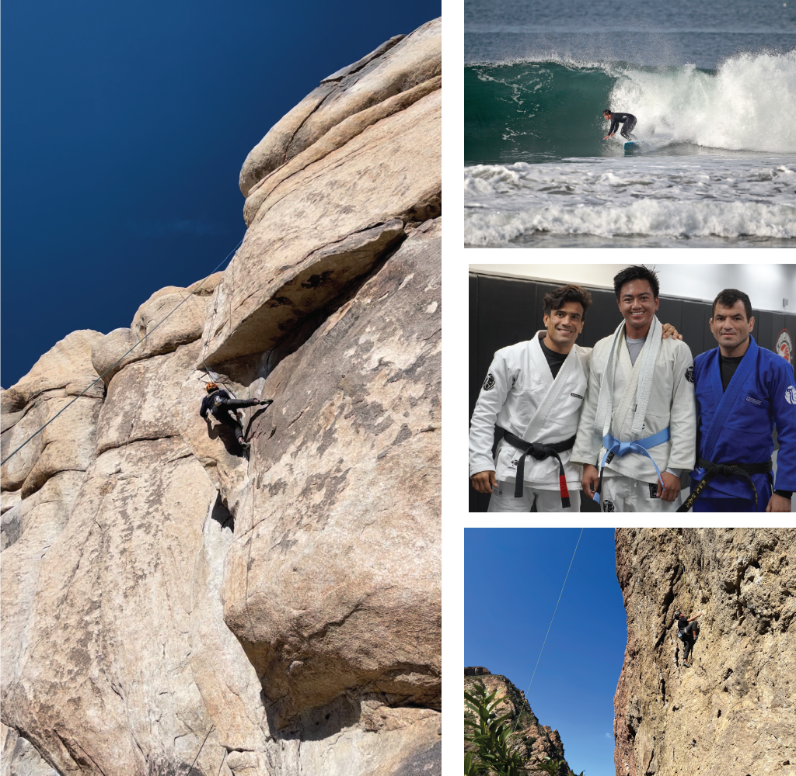

```{r load_packages, message=FALSE, warning=FALSE, include=FALSE} 
library(fontawesome)
```

## Bio
<br>
Welcome to my page! I am an incoming PhD Student at the Keck School of Medicine studying Development, Stem Cells, and Regenerative Medicine. I am highly interested in understanding the genetic regulatory networks and molecular signal pathways that drive developmental patterns, and hope to use these pathways to treat chronic disease and congenital abnormalities.

---

## Research Focus
<br>
I currently study human kidney development in the [Lindström Lab](https://lindstromlab.usc.edu/), with an emphasis on the nephron (filtration unit of the kidney). I am specifically interested in the Wnt/β-catenin pathway's link to the nascent nephron's cell identities and morphogenetic features. I hope to leverage *in vitro* hiPSC kidney organoids, and multi-omic sequencing, and high-resolution imaging to create developmental blueprints for kidney organogenesis.

I am highly motivated to build off our past atlases of [human](https://sckidney.flatironinstitute.org/) and [mouse](https://cello.shinyapps.io/kidneycellexplorer/) nephrogenesis to create regenerative cell types for therapeutic discovery and renal replacement therapy. 

---

### Education

|  |  |
|:---------------------------------------------|:----------------|
| **University of Southern California, Los Angeles** | [2023 - ]{style="float:right"} |
| Ph.D. in Development, Stem Cells, and Regenerative Medicine |
|<br>|   |
| **University of Southern California, Los Angeles** | [2020 - 2021]{style="float:right"}  |
| M.Sc. in Stem Cell Biology and Regenerative Medicine ||
|<br>|   |
| **University of Southern California, Los Angeles** | [2016 - 2020]{style="float:right"} |
| B.Sc. in Business Administration ||

---

## Technical Skills

|  |  |
|:------------------------------------------------|:--------------------|
| `r fontawesome::fa("flask", fill = "#800020")` **Experimental**  | `r fontawesome::fa("bar-chart", fill = "#800020")` **Bioinformatic**  |
| --- | --- |
| hiPSC Cell Culture | R `r fontawesome::fa("r-project", fill = "gray")` |
| Directed Organoid Differentiation | bash/linux/HPC `r fontawesome::fa("linux", fill = "gray")` |
| Immunofluorescent Staining | sc/snRNA-seq Analyses |
| Microsurgery Dissection (<100µm) | sc/snRNA-seq Analyses |
| Live Tissue Imaging | sc/snATAC-seq Analyses |
| Confocal and Widefield Microscopy | bulkRNA-seq Analyses |
| RNA Isolation and cDNA Synthesis | FIJI |
| scRNA-seq library prep | Imaris |
| Genotyping with PCR and Western blot ||

---

## In the Press
<br>
June 2023 \| [USC Stem Cell’s journey towards 1,000 mini-kidneys begins with $1 million from KidneyX](https://keck.usc.edu/usc-stem-cells-journey-towards-1000-mini-kidneys-begins-with-1-million-from-kidneyx/) 

---

### Hobbies
<br>
You can usually find me surfing, rock-climbing, or training brazilian jiu-jitsu! I also love cooking and yoga.

{width=90%}
